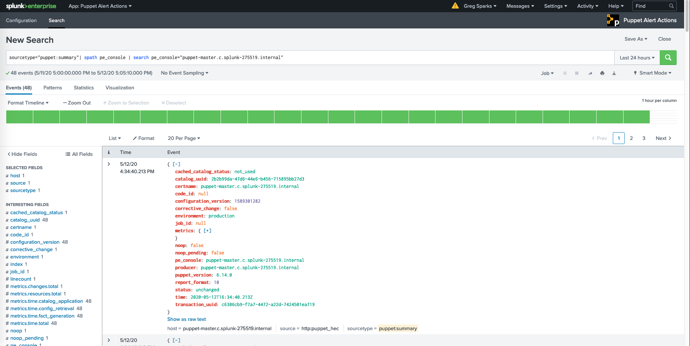
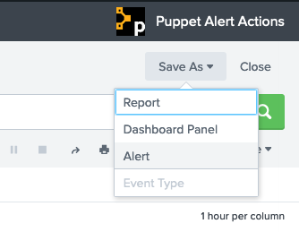
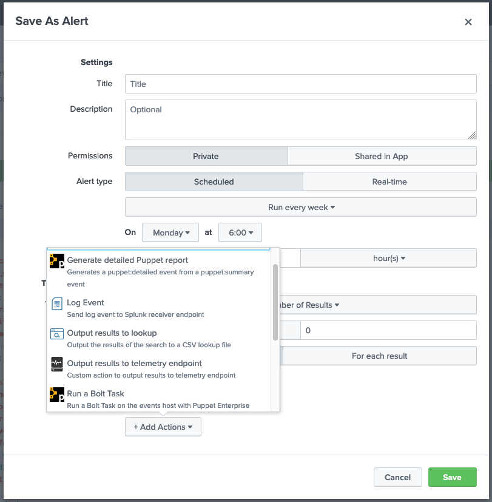

Puppet Alert Actions
==============

Description
-----------
This is a Splunk Addon that can trigger actions in Puppet Enterprise such as a task execution or report generation based on data received from Puppet Enterprise. To use this addon it must be installed alongside the (splunk_hec)[https://forge.puppet.com/puppetlabs/splunk_hec] report processor provided in the [Puppet Forge](https://forge.puppet.com/puppetlabs/splunk_hec). The report processor sends data from Puppet to Splunk via the [HTTP Event Collector](https://docs.splunk.com/Documentation/Splunk/latest/Data/UsetheHTTPEventCollector).

This is an excellent companion to the (Puppet Report Viewer)[https://splunkbase.splunk.com/app/4413/] because it can trigger actions based on data sent to Splunk via the report viewer.

The steps to get this addon working are:

1. Install the (Puppet Alert Actions)[https://splunkbase.splunk.com/app/4928/] addon (Note: If you were previously using actions with the Puppet Report Viewer you may need to delete `/opt/splunk/etc/apps/TA-puppet-report-viewer/default/alert_actions.conf` on your splunk server and then restart splunk.)
2. Create at least one HEC input in Splunk.
3. Configure the new Puppet Alert Actions app: add an account, set puppet URIs and HEC token. (Note: Account refers your Puppet Enterprise username)
4. Install the (splunk_hec)[https://forge.puppet.com/puppetlabs/splunk_hec] module in your Puppet environment and configure with the HEC token and Splunk Server

Once configured, you should be able to save Splunk Searches as alerts which will trigger the specified action (bolt task, report generation, etc.) whenever a new piece of information that matches the search is sent to Splunk.

Using the addon:

1. Create a valid Splunk search\

2. Save your search as an alert\

3. Configure your alert action\



### Troubleshooting and verification

To check the logs of the individual alerts being run you can search the internal log index in splunk: `index=_internal sourcetype=splunkd component=sendmodalert` however not all error messages will show depending on the debug level of your installation.

Individual alert actions log to the the Splunk folder on the system running the actions also, so one can see more verbose logs in `/opt/splunk/var/log/splunk`

##### Binary File Declaration

```
bin/ta_puppet_alert_actions/aob_py3/pvectorc.cpython-37m-x86_64-linux-gnu.so: this file does not require any source code
bin/ta_puppet_alert_actions/aob_py3/setuptools/cli.exe: this file does not require any source code
bin/ta_puppet_alert_actions/aob_py3/setuptools/cli-32.exe: this file does not require any source code
bin/ta_puppet_alert_actions/aob_py3/setuptools/cli-64.exe: this file does not require any source code
bin/ta_puppet_alert_actions/aob_py3/setuptools/gui.exe: this file does not require any source code
bin/ta_puppet_alert_actions/aob_py3/setuptools/gui-32.exe: this file does not require any source code
bin/ta_puppet_alert_actions/aob_py3/setuptools/gui-64.exe: this file does not require any source code
```
